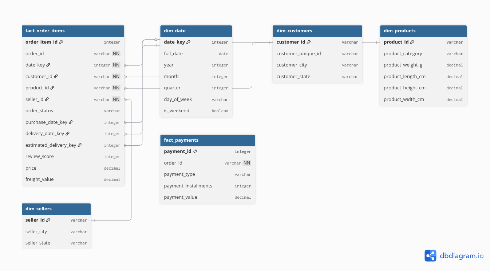

# Olist Data Warehouse

A dimensional data warehouse built on the Olist 
e-commerce dataset using Kimball methodology.

## Grain
One row in fact_order_items represents one item 
purchased within a single order on the Olist marketplace.

## Star Schema Design

## Tables
- fact_order_items — central fact table
- fact_payments — payments fact table  
- dim_customers — customer dimension
- dim_products — product dimension
- dim_sellers — seller dimension
- dim_date — date dimension (role-playing)